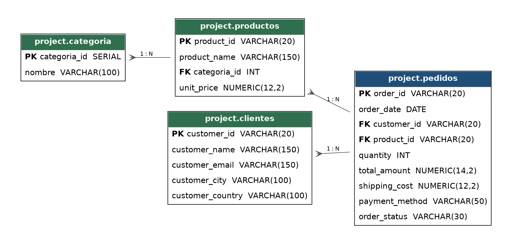

# Capstone Project: Análisis de Ventas E-commerce

## 1. Problema de negocio

Una empresa de e-commerce que opera en varios países de Latinoamérica y España
necesita entender mejor el comportamiento de sus ventas para tomar decisiones
de marketing, inventario y retención de clientes. Concretamente, el negocio
quiere responder:

- ¿Quiénes son los clientes más valiosos (mayor gasto acumulado), para
  priorizarlos en campañas de fidelización?
- ¿Cómo evolucionan las ventas mes a mes, para detectar estacionalidad y
  planificar stock/promociones?
- ¿Qué productos venden menos, para evaluar si conviene descontinuarlos,
  promocionarlos o revisar su precio?
- ¿Cómo se comparan los pedidos dentro de cada categoría, para identificar
  las operaciones más grandes por categoría?

Antes de responder estas preguntas, el dataset crudo tiene nulos en columnas
críticas (fechas y montos), producto de errores de carga en el sistema de
origen, que hay que detectar y resolver para no distorsionar el análisis.

## 2. Estructura del proyecto

```
capstone_project/
├── README.md
├── data/
│   └── ecommerce_dataset_raw.csv     # dataset crudo (2000 filas, 16 columnas, con nulos)
├── diagrams/
│   └── er_diagram.png                # diagrama entidad-relacion de las 4 tablas
├── docs/
│   └── executive_summary.md          # hallazgos redactados para un equipo directivo
└── sql/
    ├── 01_schema_and_data.sql        # crea la base + esquema "project" + 4 tablas + carga + limpieza (COALESCE)
    └── 02_analysis_queries.sql       # las 10 consultas de analisis, comentadas (4 base + 6 preguntas complejas)
```

Es la estructura mínima que pide un repositorio profesional: **un .sql con
toda la creación de tablas e inserción/carga** (que además incluye la
limpieza, ya que es parte de dejar los datos listos para consultar), **un
.sql con las consultas de análisis comentadas**, y este **README.md**. Los
archivos en `diagrams/` y `docs/` son material de apoyo adicional (no
sustituyen a los dos `.sql` ni al README).

### Modelo de datos (4 tablas normalizadas, esquema `project`)

Las 4 tablas viven dentro del esquema de PostgreSQL **`project`** (no en
`public`). `01_schema_and_data.sql` crea ese esquema con
`CREATE SCHEMA IF NOT EXISTS project;` y fija `SET search_path TO project;`
antes de crear las tablas, así que todo el resto del script (y
`02_analysis_queries.sql`) puede referenciarlas sin prefijo.

- **project.categoria** (categoria_id PK, nombre) — 7 filas
- **project.clientes** (customer_id PK, customer_name, customer_email, customer_city, customer_country) — 350 filas
- **project.productos** (product_id PK, product_name, categoria_id FK → categoria, unit_price) — 70 filas
- **project.pedidos** (order_id PK, order_date, customer_id FK → clientes, product_id FK → productos, quantity, total_amount, shipping_cost, payment_method, order_status) — 2000 filas

### Diagrama Entidad-Relación (ER Diagram)



`categoria` se relaciona 1:N con `productos` (una categoría tiene muchos
productos), y tanto `clientes` como `productos` se relacionan 1:N con
`pedidos` (un cliente hace muchos pedidos; un producto aparece en muchos
pedidos). `pedidos` es la tabla de hechos: concentra las dos foreign keys
(`customer_id`, `product_id`) más las métricas de cada venta.

El diagrama se generó con Graphviz a partir de las mismas definiciones de
`01_schema_and_data.sql` (podés regenerarlo vos mismo desde pgAdmin con
clic derecho sobre la base → **ERD Tool**, como sugiere la guía del
capstone, y debería coincidir con este).

## 3. Requisitos

- PostgreSQL 13 o superior (se probó en PostgreSQL 16).
- Cliente `psql` disponible en la terminal (el primer script usa el
  meta-comando `\c` de psql para crear la base y reconectarse a ella).

## 4. Cómo correr el código

Desde la carpeta `sql/`, ejecutar los scripts **en este orden**:

```bash
# 1. Crea la base "capstone_project", el esquema "project", las 4 tablas,
#    carga el dataset crudo (con nulos intencionales) y limpia esos nulos
#    con COALESCE. Se conecta a cualquier base existente (ej. "postgres");
#    el propio script crea "capstone_project" y se reconecta con \c.
psql -U postgres -f 01_schema_and_data.sql

# 2. Corre las 10 consultas de analisis (4 base + 6 preguntas de negocio
#    complejas), ya sobre los datos limpios.
psql -U postgres -d capstone_project -f 02_analysis_queries.sql
```

> Nota tecnica: `01_schema_and_data.sql` usa `CREATE DATABASE` seguido de
> `\c capstone_project` para crear la base y "saltar" a ella dentro del
> mismo archivo — por eso necesita `psql` (no funciona igual con un driver
> que solo ejecuta el archivo como una sola sentencia SQL plana).

El dataset crudo (`data/ecommerce_dataset_raw.csv`) ya está embebido como
sentencias `INSERT` dentro de `01_schema_and_data.sql`, así que no hace
falta importarlo por separado con `\copy`; el CSV se incluye igual en
`data/` como respaldo/documentación del origen de los datos.

## 5. Limpieza de datos — hallazgos

Sobre 2000 pedidos, el dataset crudo tenía nulos en tres columnas críticas:

| Columna | Nulos detectados | % del total |
|---|---|---|
| `order_date` | 60 | 3.0% |
| `total_amount` | 80 | 4.0% |
| `shipping_cost` | 100 | 5.0% |

Verificación de tipos (antes y después de limpiar, vía
`information_schema.columns`): `order_date` es `DATE`, `total_amount` y
`shipping_cost` son `NUMERIC(14,2)` / `NUMERIC(12,2)` — los tipos ya eran
correctos, el problema era solo la ausencia de valores.

Estrategia de resolución con `COALESCE` (documentada en la PARTE C de
`01_schema_and_data.sql`):

- **`shipping_cost` nulo → 0**: se asume envío gratis cuando no quedó
  registrado el costo (política más común para datos faltantes de envío).
- **`total_amount` nulo → se recalcula** como `unit_price × quantity`
  tomando el precio desde `productos`, en vez de imputar un valor
  arbitrario — así el dato reconstruido es consistente con el resto del
  modelo.
- **`order_date` nulo → se imputa con la fecha más frecuente** (moda) del
  dataset. Es una simplificación razonable para este ejercicio; en un
  entorno productivo se recomendaría en cambio marcar el registro para
  revisión manual o recuperarlo del sistema de origen, ya que imputar
  fechas afecta análisis de series temporales.

Después de aplicar los `UPDATE`, la verificación de nulos da **0 en las
tres columnas**, y se endurece el esquema con
`ALTER TABLE ... ALTER COLUMN ... SET NOT NULL` para que no puedan volver a
colarse nulos sin que una futura carga falle explícitamente.

## 6. Análisis — resultados y hallazgos

### 6.1 Top 5 clientes por gasto total

| customer_id | Cliente | País | Pedidos | Gasto total |
|---|---|---|---|---|
| CUST-00195 | Valentin Ramirez Sanchez | Uruguay | 11 | 5,012,899.59 |
| CUST-00342 | Valentino Vega | Argentina | 9 | 4,296,493.31 |
| CUST-00241 | Franco Silva | España | 8 | 4,280,841.62 |
| CUST-00296 | Dr(a). Juan Ignacio Garcia | Chile | 5 | 4,172,691.20 |
| CUST-00114 | Delfina Cordoba | Colombia | 8 | 4,017,256.57 |

**Hallazgo:** el cliente top (CUST-00195) no es necesariamente el que más
pedidos hizo en términos absolutos, sino el que combina buena frecuencia
(11 pedidos) con tickets altos — es un candidato natural para un programa
VIP o descuentos por volumen.

### 6.2 Ventas totales por mes

Se calculó con `DATE_TRUNC('month', order_date)` sobre los 25 meses que
cubre el dataset (sep-2024 a sep-2026, este último mes parcial). Hallazgos
principales:

- **Pico de ventas en diciembre 2025**: 148 pedidos y ~25.8M en ventas,
  claramente por encima del resto de los meses — coherente con estacionalidad
  de fin de año.
- Segundo pico en **enero 2025** (~22M) y otro salto en **julio 2026**
  (~20M), lo que sugiere revisar si hubo campañas puntuales esos meses.
- El mes más bajo (excluyendo sep-2026, que está incompleto) es
  **mayo 2026**, con ~7.8M — posible ventana para promociones de reactivación.

### 6.3 Tres productos menos vendidos (por unidades)

| Producto | Categoría | Unidades vendidas |
|---|---|---|
| Set de Sabanas | Hogar | 40 |
| Kit de Cuidado Facial | Belleza | 47 |
| Juego de Mesa Familiar | Juguetes | 50 |

**Hallazgo:** los tres productos con menor rotación pertenecen a categorías
distintas (Hogar, Belleza, Juguetes), por lo que el problema parece ser del
producto puntual y no de la categoría en general — vale la pena revisar
precio, visibilidad en el catálogo o directamente evaluar su continuidad.

### 6.4 Ranking de pedidos por categoría (`RANK()`)

Se usó una window function para ordenar, dentro de cada categoría, los
pedidos de mayor a menor `total_amount`. Por ejemplo, en la categoría
**Belleza** el pedido más grande fue `ORD-000370` (Kit de Cuidado Facial,
166,685.95), seguido por un grupo de 10 pedidos empatados en el puesto 2
(todos del producto "Set de Maquillaje" al mismo precio) — `RANK()` asigna
el mismo puesto a los empates y salta los puestos siguientes (el próximo
pedido distinto queda en el puesto 12, no en el 3), lo cual es el
comportamiento esperado de `RANK()` frente a `DENSE_RANK()`.

### Uso de CTEs (`WITH`)

Las 4 consultas base de `02_analysis_queries.sql` (PARTE A) están
escritas con **CTEs** (`WITH ... AS (...)`)
en vez de subconsultas anidadas: primero se arma un resultado intermedio con
nombre propio (`gasto_por_cliente`, `ventas_mensuales`, `ventas_por_producto`,
`pedidos_detalle`) y recién después la consulta final lo filtra, ordena o le
aplica la window function. Esto hace que cada `SELECT` final quede muy simple
de leer, y que el cálculo intermedio se pueda reutilizar o depurar por separado
si hace falta.

## 7. Preguntas de negocio complejas (análisis avanzado)

Además de las 4 consultas base, la PARTE B de `sql/02_analysis_queries.sql`
responde **6 preguntas de negocio complejas** (se pedían al menos 5), combinando
CTEs con funciones de ventana (`SUM() OVER`, `LAG()`, `ROW_NUMBER()`) y
joins entre 3 tablas:

1. **Concentración de ingresos (Pareto):** ¿qué % de clientes genera el
   80% de la facturación? → 48% de los clientes (168 de 350).
2. **Crecimiento mes a mes:** ¿cómo varían las ventas contra el mes
   anterior? → pico de +80% en diciembre 2025, caída de -62% en mayo 2026.
3. **Desempeño por país:** ¿qué países tienen mejor ticket promedio y
   frecuencia de compra? → Chile y Uruguay lideran; México queda último.
4. **Método de pago vs. cancelaciones:** ¿algún medio de pago cancela
   más? → Mercado Pago 18.9% vs. Transferencia 11.9%.
5. **Peso del envío sobre el ticket, por categoría:** ¿en qué categorías
   el envío pesa proporcionalmente más? → Libros 10.8% vs. Electrónica 0.1%.
6. **Clientes valiosos en riesgo de abandono:** compradores recurrentes
   (3+ pedidos) sin comprar hace 349-587 días.

El detalle completo de cada hallazgo, su implicancia de negocio y las
recomendaciones asociadas está redactado para un **equipo directivo** en
[`docs/executive_summary.md`](docs/executive_summary.md) — ese documento,
no este README, es el que está pensado para presentar tal cual a
liderazgo.

## 8. Conclusiones y recomendaciones (nivel técnico)

1. Antes de cualquier análisis, siempre vale la pena perfilar nulos por
   columna — un 3-5% de nulos en columnas de precio/fecha puede pasar
   desapercibido pero distorsiona sumas y agrupaciones por mes si no se
   trata explícitamente.
2. El pico de ventas de diciembre sugiere reforzar stock e infraestructura
   de despacho en ese mes con anticipación.
3. Los 5 clientes top representan gasto muy por encima del promedio; un
   programa de fidelización dirigido a ellos tiene alto potencial de
   retorno con bajo esfuerzo de segmentación.
4. Los productos de baja rotación identificados son candidatos concretos
   para una revisión de catálogo (precio, promoción o descontinuación).

## 9. Notas y limitaciones

- El dataset es sintético (generado con Faker + reglas de negocio simples),
  pensado para practicar limpieza y análisis SQL, no refleja una empresa real.
- La imputación de `order_date` por moda es una simplificación pedagógica;
  en producción se preferiría investigar el origen del dato faltante.
- El mes de septiembre 2026 aparece con muy pocos pedidos porque el
  dataset se generó con esa fecha como límite superior (mes en curso al
  momento de generar los datos), no porque haya una caída real de ventas.

## 10. Glosario aplicado a este proyecto

- **Schema (Esquema):** en este proyecto es literalmente el esquema
  `project` de PostgreSQL — el "plano" que agrupa las 4 tablas
  (`categoria`, `clientes`, `productos`, `pedidos`) y sus relaciones. Se
  crea en `01_schema_and_data.sql` con `CREATE SCHEMA IF NOT EXISTS project;`.
- **Query (Consulta):** cada `SELECT` de `02_analysis_queries.sql` es una
  consulta: la pregunta concreta que le hacemos a la base ("¿quiénes son
  los 5 clientes que más gastaron?", etc.).
- **CTE (Common Table Expression):** el bloque `WITH nombre AS (...)` que
  antecede a cada una de las 4 consultas de análisis (ver sección
  "Uso de CTEs" más arriba). Cada CTE es como una "nota adhesiva" con el
  resultado intermedio, que la consulta final usa como si fuera una tabla.
- **ER Diagram (Diagrama Entidad-Relación):** el dibujo en
  `diagrams/er_diagram.png` (sección 2 de este README) que muestra cómo
  se conectan `categoria`, `productos`, `clientes` y `pedidos` mediante
  sus claves primarias (PK) y foráneas (FK). Se generó con Graphviz a
  partir del propio esquema SQL; en pgAdmin se puede obtener el mismo
  resultado con clic derecho sobre la base → **ERD Tool**.
